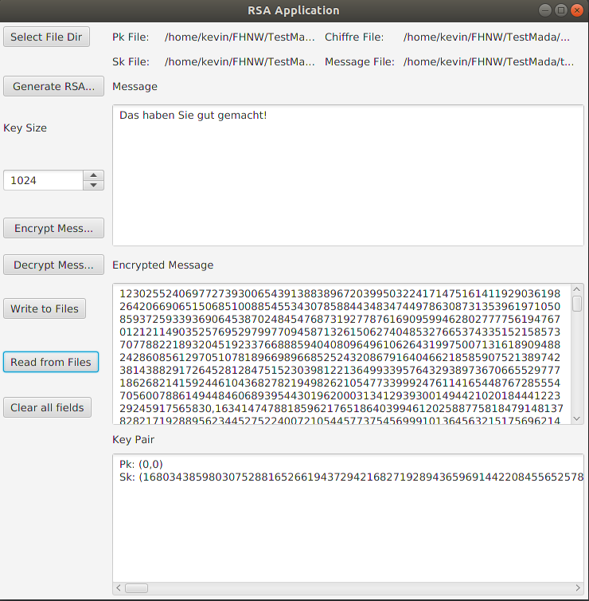

#RSA Application

>This Small Application implements a character wise encryption using the RSA algorithm.  
The implementation is not either save or performance optimized.  
The only purpose is the understanding of the mathematical concepts of RSA.

##Usage

All Functions can be directly Tested within the GUI.

***Operating errors are not handled an will lead to exceptions***

- Select File Dir: Browse to your local directory where you want the Files to be stored. (pk.txt, sk.txt, chiffre.txt, text.txt)
- Read from Files: Reads the Files in the preselected directory if they exists. It is not mandatory that all files exists.
- Write to Files: Writes the current values as displayed in the Text-Areas into the preselected directory
- Generate RSA Keys: Generates random RSA Key-Pairs of the provided size
- Encrypt Message: Encrypts the Message which is entered in the Text-Area. This Area is freely editable.
- Decrypt Message: Decrypts the Message which is displayed ind the Text-Area. This Area is not editable.

##Dependencies
- Java 11
- Junit 4.12